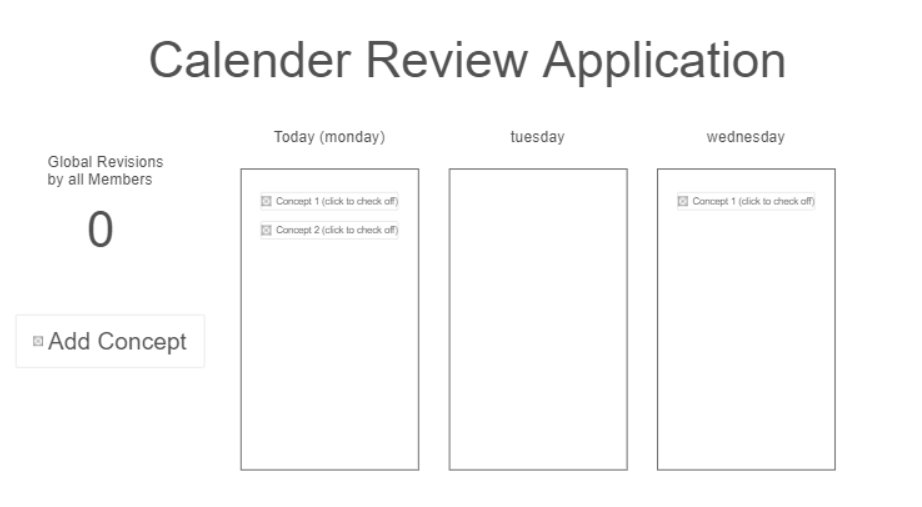

# Calender Review Application
[notes for this project](notes.md)
## Specification Deliverable
### Elevator Pitch
Are you a busy student who is always forgetting everything you learn?  Are you always studying the night before a test? Do you wish  there was a better way to memorize information? Introducing the Calender Review Application, the easy way for you to retain the information you need to know, all while conveniently accessible on the go.  The Calender Review Application has you login and input new concepts that you learn each day.  After a concept is added to your calender, our state-of-the-art algorithm will generate specific days for revision of that concept--maximizing memory retention.  The Calender Review Application also includes a global tally of concepts reviewed by all members, keeping you motivated to learn.
### Design

### Key Features
- Login feature with stored calender account data
- Ability to add concepts
- Algorithm which spaces concept revision
- UI showing current day and a few days ahead
- Ability to check-off concepts after they are reviewed
- Global revision tally
### Technologies
The required technologies will be utilizated in the following manner:

- **HTML** - The structure of two main HTML pages (login page and calender page)
- **CSS** - The style of web pages (simple palette consisting of white and one other color, font and font-size)
- **JavaScript** - Button functionality and login page
-  **React** - React could to used to create the UI for each day listed on the calender
-  **Service** - Services could be used for login, current global revision status, and an API relating to some calender event (e.g. is the current day a holiday)
-  **Authentication** - The login page will have users login with their credentials
-  **Database Data** - Store users and user calender data
-  **Websocket** - The global revision tally will broadcast to all users as it is updated

## HTML Deliverable

- **HTML Pages** - The application uses four pages (login, myCalender, concepts, global tally)
- **Links** - The application has a navigation widget at the top of each page for easy navigation. An additional link is also given on the calender page to go to the concepts page.
- **Text** - A welcome message is given in index.html. Instructional text is given on the calender page.
- **Images** - A picture of the earth is used on the global tally page.
- **Login** - A sample login interface is given on the home page in index.html.
- **Database** - User data is shown on the concepts page, showing concept data.  The user's username is also displayed on all pages.
- **WebSocket** - The global tally on the tally page will represent realtime global revisions.
- **API** - An API will be used to show upcoming holidays ( a sample of this is shown on the calender page).

## CSS Deliverable

- **Header and Navigation** - Each page of the application has a cohesive header and navigation bar
- **Body Content** - The main content of each page is styled
- **Window Resizing** - The application works for different screen sizes
- **Application Elements** - The application makes use of animations for backgrounds and Bootstrap is used for buttons and text entries
- **Text Content** - Consistent fonts are used throughout the application, and text content is properly stylized
- **Images** - The image on the global tally page was made into a background using CSS

## React Deliverable

- **Simon deployed** - Simon was successfully deployed
- **Vite** - The application was bundled using Vite
- **Components** - A main app component was created, which could route to other page components (login component, calender component, concepts component, and global tally component).  The login component makes use of authentication components.  The calender component uses day components, which in turn consist of task components.  The application dynamically creates task components based on concept data for a given day.  The concepts page component has a database component, which allows the user to view all stored concept data (concept data is currently stored via local storage, but will eventually use a database).  The global tally page will eventually use Websocket to represent realtime global revisions from all users, but currently only shows local revisions shown through local storage.
- **Router** - The central app component has routing to all pages of the application (login page, calender page, concepts page, tally page).
- **Hooks** - Hooks are used throughout the application.  The app component uses usestate for login authentication and a global tally counter.  The calender page uses usestate to load concept data.   The concept page uses useState to dynamically add concepts to concept data.  The database component uses useEffect to aid in loading local storage into the concept data table.
