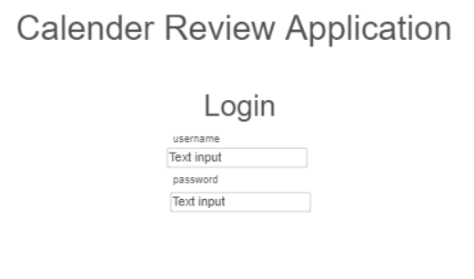

# Calender Review Application
[notes for this project](notes.md)
## Specification Deliverable
### Elevator Pitch
Are you a busy student who is always forgetting everything in all of your classes?  Are you alwaysing studying the night before a test? Do you wish that there was a better way to memorize information? Introducing the Calender Review Application, the easy way for you to retain the information you need to know, all while conviently accessible on the go.  The Calender Review Application has you login and input new concepts that you learn each day.  After a concept is added to your calender, our state-of-the-art algorithm will generate specific days for revision of that concept--maximizing memory retention.  The Calender Review Application also includes a global tally of concepts reviewed by all members, keeping you motivated to learn.
### Design

### Key Features
### Technologies
